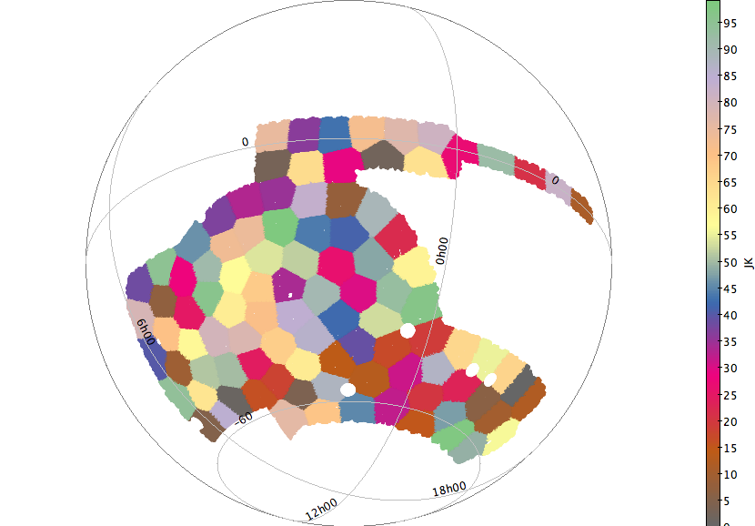

# Galaxy-galaxy lensing measurements and tests
Credit: Judit Prat, Carles Sanchez, ... (add your name here)

This pipeline runs galaxy-galaxy lensing measurements using TreeCorr in a fast way, by parallelizing the runs with different jackknife regions. 
Steps of the run function (will depend on test, but generally):
1) Loads corresponding data for each test. That usually means: lens sample, randoms, source sample. Splits in redshift bins if necessary.
2) Creates a folder to save the runs for the test. 
3) For each jackknife region it selects sources surrounding it, and it computes the two-point correlation for just the lenses in one jackknife patch and the sources around it (on a scale larger than the largest scales relevant for the measurement). This is what the function 'run_treecorr_jackknife' does. Both for lenses and randoms.
4) Computes or loads the corresponding mean response for metacalibration.
5) Combines the measurements from each jackknife region to obtain the mean measurement and the jackknife covariance. Functions: numerators_jackknife, process_run. Includes random point subraction and metacalibration responses.
6) Computes boost factors if necessary and saves them to file in two-point file format (only implemented for the fiducial measurement). Currently the boost factors are not applied to the measurements, we only compute them and save them. 
7) Plots the results. Currently produces all plots in the same way as in the Y1GGL paper (https://arxiv.org/abs/1708.01537).

The way this pipeline is structured is as follows: 
- There is a main class called GGL, which includes functions used in more than one test. 
- Then, each test is a subclass of GGL and therefore inherits all the functions. 

The tests included in this pipeline are (in parenthesis the subclass it belongs to):
- Fiducial measurment (Measurement)
- Gammax (Measurement)
- Boost factors (Measurement)
- Gammat around random points (Measurement)
- NK responses, to check their scale dependence (Responses)
- Gammat around stars, bright and faint (TestStars)
- PSF residuals around lenses and randoms (TestPSF)
- Split size and snr (TestSizeSNR)
- Split in observing conditions, such as airmass, seeing, etc (TestSysMaps)

Getting started: 
1. Clone this repo at NERSC. It is strongly recommended that you run this at NERSC because the Y3 catalogs are there. Another option would be to download them to your local computer but the files are huge and they might get updated a few times. 
2. Install the dependencies. In particular, it needs to have `destest` installed, which is another DES repo that handles the Y3 catalogs interface which can be cloned here: https://github.com/des-science/destest. It also needs `twopoint`: https://github.com/joezuntz/2point/tree/master, and other packages such as TreeCorr and other basic ones. 
3. Run `create_redmagic.py`. This creates the lens.fits and random.fits files, which are then used by `ggl.py`. These files contain the lens and random samples split into jackknife regions.
4. Run `ggl.py`. Check the end of the file to change which tests to run. For instance, if you only want to run the measurements and corresponding plots set the other tests to False. 
5. If you want to push any changes, do it on the `develop` branch (to go to the develop branch you can do: git checkout develop), and when you are sure they are stable you can merge them to `master`. 

Plot of 100 jackknife regions for Y3: 

Please contact Carles Sanchez (carles.sanchez.alonso@gmail.com) or Judit Prat (jpratmarti@gmail.com) for comments or questions. 
